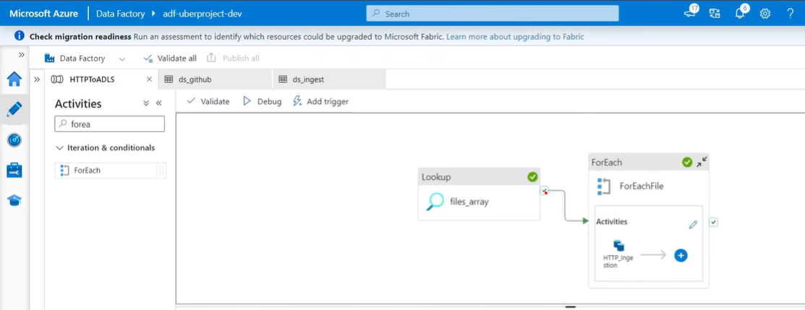
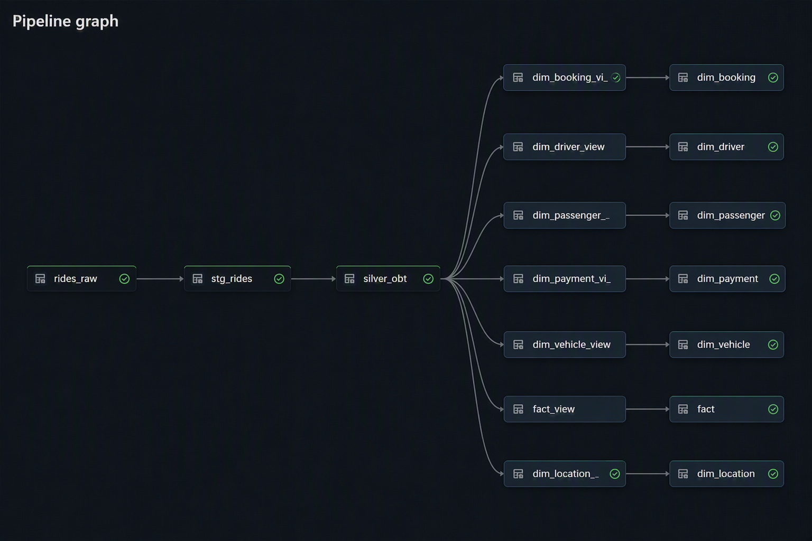

# Uber

## Overview

This project builds an end-to-end Uber Ride Analytics platform using Azure services and Databricks. The solution processes both streaming and batch ride data, applies Medallion Architecture (Bronze → Silver → Gold), and delivers analytics-ready dimensional models for reporting.

## Data Flow

### 1. Event Streaming
- Ride booking events are generated from a web application.
- Events are published to Azure Event Hub.
- Azure Databricks consumes events in real time.

### 2. Batch Ingestion
- Azure Data Factory ingests datasets from GitHub into ADLS Gen2.
- Databricks reads reference/master data from ADLS.

### 3. Silver Layer
- Combines batch and streaming data.
- Applies data quality checks and business transformations.
- Creates a consolidated **Operational Business Table (OBT)**.

### 4. Gold Layer
- Builds a Star Schema model from OBT.
- Creates Fact and Dimension tables for analytics and reporting.

## Technology Stack

- Azure Event Hub
- Azure Data Factory (ADF)
- Azure Data Lake Storage Gen2 (ADLS)
- Azure Databricks
- Apache Spark
- Delta Lake
- SQL
- Python
- GitHub

## Pipeline

## ADF- HTTP to ADLS

This pipeline uses a Lookup activity to retrieve a list of source files and a ForEach loop to ingest data from HTTP endpoints into Azure Data Lake Storage Gen2 (ADLS). It enables automated and scalable batch ingestion of source datasets.

## Streaming Table

Databricks streaming tables process real-time ride events from the rides_raw source and continuously load them into the streaming_rides table, providing a near real-time data ingestion framework.

##End to End Pipeline

The complete data transformation flow from raw ride data to analytics-ready datasets. Data moves through staging and Silver layers to create an Operational Business Table (OBT), which is then transformed into Gold-layer Fact and Dimension tables following a Star Schema design for reporting and analytics.

## Key Features

- Real-time event streaming
- Batch and streaming integration
- Medallion Architecture
- Delta Lake storage
- Star Schema modeling
- Data quality validation
- Scalable analytics platform

## Business Outcomes

- Ride demand analysis
- Revenue reporting
- Driver performance tracking
- Passenger behavior analytics
- Payment trend analysis
- Business Intelligence dashboards
